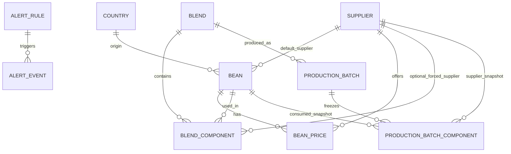

# Modele de donnees MVP - Outil de cout cafe pour torrefacteur

Version: 0.1  
Date: 30 juin 2026

## 1. Objectif du modele

Ce modele de donnees sert a construire une premiere version de l'outil centree sur :

- les grains ;
- les fournisseurs ;
- les tarifs dates ;
- les assemblages ;
- les calculs de cout ;
- les batchs de production avec cout fige ;
- les alertes.

Le principe cle : un prix n'est jamais une simple valeur attachee a un grain. C'est un tarif date, rattache a un grain, a un fournisseur et a une periode de validite.

## 2. Diagramme simplifie



## 3. Tables principales

## countries

Pays d'origine du cafe.

| Champ | Type | Obligatoire | Notes |
|---|---|---:|---|
| id | uuid | oui | identifiant technique |
| name | text | oui | nom du pays |
| region | text | non | Afrique, Amerique latine, Asie, etc. |
| is_active | boolean | oui | true par defaut |
| created_at | datetime | oui | date de creation |
| updated_at | datetime | oui | date de modification |

## suppliers

Fournisseurs ou importateurs.

| Champ | Type | Obligatoire | Notes |
|---|---|---:|---|
| id | uuid | oui | identifiant technique |
| name | text | oui | nom fournisseur |
| contact_name | text | non | contact principal |
| email | text | non | email |
| phone | text | non | telephone |
| default_currency | text | oui | EUR par defaut |
| notes | text | non | remarques |
| is_active | boolean | oui | true par defaut |
| created_at | datetime | oui | date de creation |
| updated_at | datetime | oui | date de modification |

## beans

Grains ou references cafe vert.

| Champ | Type | Obligatoire | Notes |
|---|---|---:|---|
| id | uuid | oui | identifiant technique |
| commercial_name | text | oui | ex. Bresil Santos, Colombie Excelso |
| country_id | uuid | oui | lien vers countries |
| default_supplier_id | uuid | non | fournisseur principal |
| species | text | oui | arabica, robusta, blend vert, autre |
| variety | text | non | bourbon, caturra, etc. |
| process | text | non | lave, naturel, honey, autre |
| unit | text | oui | kg par defaut |
| notes | text | non | informations qualite |
| is_active | boolean | oui | true par defaut |
| created_at | datetime | oui | date de creation |
| updated_at | datetime | oui | date de modification |

## bean_prices

Tarifs negocies ou estimes pour un grain.

| Champ | Type | Obligatoire | Notes |
|---|---|---:|---|
| id | uuid | oui | identifiant technique |
| bean_id | uuid | oui | lien vers beans |
| supplier_id | uuid | oui | lien vers suppliers |
| price_per_kg | decimal(12,4) | oui | prix du cafe vert par kg |
| currency | text | oui | EUR, USD, etc. |
| valid_from | date | oui | debut de validite inclus |
| valid_to | date | non | fin de validite incluse, vide = ouvert |
| tariff_type | text | oui | contract, spot, estimate, market, other |
| source_reference | text | non | numero contrat, email, note interne |
| notes | text | non | commentaire |
| created_at | datetime | oui | date de saisie |
| updated_at | datetime | oui | date de modification |

Regles importantes :

- `price_per_kg` doit etre strictement positif.
- `valid_to` doit etre vide ou superieur/equal a `valid_from`.
- Pour un meme couple `bean_id` + `supplier_id`, deux periodes ne doivent pas se chevaucher sans validation explicite.
- Un tarif ouvert avec `valid_to` vide doit etre ferme automatiquement ou manuellement avant de saisir un nouveau tarif ouvert sur le meme grain et fournisseur.

## blends

Assemblages ou recettes de cafe.

| Champ | Type | Obligatoire | Notes |
|---|---|---:|---|
| id | uuid | oui | identifiant technique |
| name | text | oui | nom de l'assemblage |
| description | text | non | notes metier |
| roast_loss_pct | decimal(5,2) | oui | perte estimee, ex. 15.00 |
| packaging_cost_per_kg | decimal(12,4) | oui | 0 par defaut |
| energy_cost_per_kg | decimal(12,4) | oui | 0 par defaut |
| logistics_cost_per_kg | decimal(12,4) | oui | 0 par defaut |
| target_sale_price_per_kg | decimal(12,4) | non | prix de vente cible |
| max_cost_per_kg | decimal(12,4) | non | seuil de cout |
| is_active | boolean | oui | true par defaut |
| created_at | datetime | oui | date de creation |
| updated_at | datetime | oui | date de modification |

Regles importantes :

- `roast_loss_pct` doit etre compris entre 0 et 50 pour eviter les erreurs de saisie.
- Les frais par kg doivent etre positifs ou egaux a 0.

## blend_components

Composition d'un assemblage.

| Champ | Type | Obligatoire | Notes |
|---|---|---:|---|
| id | uuid | oui | identifiant technique |
| blend_id | uuid | oui | lien vers blends |
| bean_id | uuid | oui | lien vers beans |
| percentage | decimal(6,3) | oui | ex. 50.000 |
| forced_supplier_id | uuid | non | fournisseur impose pour ce grain |
| sort_order | integer | oui | ordre d'affichage |
| notes | text | non | commentaire |
| created_at | datetime | oui | date de creation |
| updated_at | datetime | oui | date de modification |

Regles importantes :

- La somme des `percentage` d'un assemblage doit etre egale a 100.
- Un meme grain peut apparaitre une seule fois par assemblage, sauf si le fournisseur impose est different.
- Si `forced_supplier_id` est rempli, le calcul doit utiliser ce fournisseur.
- Si `forced_supplier_id` est vide, le calcul utilise le fournisseur principal du grain.

## production_batches

Productions realisees. Cette table fige le resultat global du calcul au moment de la production.

| Champ | Type | Obligatoire | Notes |
|---|---|---:|---|
| id | uuid | oui | identifiant technique |
| production_date | date | oui | date de production |
| blend_id | uuid | oui | assemblage produit |
| roasted_quantity_kg | decimal(12,3) | oui | quantite obtenue |
| green_quantity_kg | decimal(12,3) | oui | quantite cafe vert consommee |
| actual_roast_loss_pct | decimal(5,2) | non | perte reelle |
| frozen_green_cost_per_kg | decimal(12,4) | oui | cout vert calcule |
| frozen_roasted_cost_per_kg | decimal(12,4) | oui | cout apres perte |
| frozen_total_cost_per_kg | decimal(12,4) | oui | cout total |
| notes | text | non | remarques |
| created_at | datetime | oui | date de creation |
| updated_at | datetime | oui | date de modification |

Regles importantes :

- Les champs `frozen_*` ne changent pas automatiquement apres creation.
- Si l'utilisateur veut recalculer, il faut une action explicite et historisee.

## production_batch_components

Detail fige des grains utilises dans un batch.

| Champ | Type | Obligatoire | Notes |
|---|---|---:|---|
| id | uuid | oui | identifiant technique |
| production_batch_id | uuid | oui | lien vers production_batches |
| bean_id | uuid | oui | grain utilise |
| supplier_id | uuid | oui | fournisseur retenu |
| percentage | decimal(6,3) | oui | pourcentage au moment de la prod |
| price_per_kg_snapshot | decimal(12,4) | oui | prix fige |
| currency_snapshot | text | oui | devise figee |
| green_quantity_kg | decimal(12,3) | oui | quantite estimee ou reelle |
| line_cost_per_kg | decimal(12,4) | oui | contribution au cout |
| created_at | datetime | oui | date de creation |

Utilite :

- expliquer un cout batch ligne par ligne ;
- conserver l'historique meme si la recette ou les tarifs changent plus tard.

## alert_rules

Regles d'alerte configurees par l'utilisateur.

| Champ | Type | Obligatoire | Notes |
|---|---|---:|---|
| id | uuid | oui | identifiant technique |
| name | text | oui | nom de l'alerte |
| alert_type | text | oui | bean_price, blend_cost, margin, tariff_expiry, missing_price |
| bean_id | uuid | non | selon type |
| blend_id | uuid | non | selon type |
| threshold_value | decimal(12,4) | non | seuil |
| comparison_operator | text | non | gt, gte, lt, lte |
| days_before_expiry | integer | non | pour expiration tarif |
| is_active | boolean | oui | true par defaut |
| created_at | datetime | oui | date de creation |
| updated_at | datetime | oui | date de modification |

## alert_events

Alertes detectees.

| Champ | Type | Obligatoire | Notes |
|---|---|---:|---|
| id | uuid | oui | identifiant technique |
| alert_rule_id | uuid | oui | lien vers alert_rules |
| detected_at | datetime | oui | date de detection |
| status | text | oui | active, acknowledged, resolved |
| message | text | oui | message lisible |
| observed_value | decimal(12,4) | non | valeur observee |
| threshold_value | decimal(12,4) | non | seuil concerne |
| acknowledged_at | datetime | non | date de traitement |
| resolved_at | datetime | non | date de resolution |

## 4. Selection d'un tarif pour un calcul

Pour calculer le prix d'un grain a une date donnee :

1. Identifier le grain.
2. Identifier le fournisseur a utiliser :
   - fournisseur impose dans la composition si present ;
   - sinon fournisseur principal du grain.
3. Chercher un tarif dans `bean_prices` avec :
   - meme grain ;
   - meme fournisseur ;
   - `valid_from <= date_calcul` ;
   - `valid_to` vide ou `valid_to >= date_calcul`.
4. Si un seul tarif est trouve, l'utiliser.
5. Si aucun tarif n'est trouve, remonter une erreur de prix manquant.
6. Si plusieurs tarifs sont trouves, remonter une erreur de conflit de tarifs.

## 5. Calcul d'un assemblage

Entrees :

- `blend_id` ;
- date de calcul ;
- devise cible, EUR par defaut.

Sorties :

- cout cafe vert par kg ;
- cout apres perte de torrefaction ;
- cout total par kg ;
- detail ligne par ligne ;
- prix manquants ;
- conflits de tarifs ;
- marge si prix de vente cible present.

Formule ligne :

```
line_cost = bean_price_per_kg * (component_percentage / 100)
```

Formule cout vert :

```
green_cost_per_kg = sum(line_cost)
```

Formule cout torrefie :

```
roasted_cost_per_kg = green_cost_per_kg / (1 - roast_loss_pct / 100)
```

Formule cout total :

```
total_cost_per_kg =
  roasted_cost_per_kg
  + packaging_cost_per_kg
  + energy_cost_per_kg
  + logistics_cost_per_kg
```

## 6. Creation d'un batch de production

Lorsqu'un batch est cree :

1. L'utilisateur choisit une date de production.
2. L'utilisateur choisit un assemblage.
3. L'utilisateur saisit la quantite produite.
4. L'outil calcule le cout a la date de production.
5. L'outil enregistre le resultat dans `production_batches`.
6. L'outil enregistre le detail fige dans `production_batch_components`.

Le batch ne depend plus des tarifs futurs apres sa creation.

## 7. Contraintes de qualite des donnees

Contraintes a prevoir des la V1 :

- noms de pays uniques ;
- noms de fournisseurs uniques ou au moins alertes en cas de doublon ;
- prix strictement positifs ;
- pourcentages d'assemblage totalisant 100 ;
- dates de tarifs coherentes ;
- detection des chevauchements de tarifs ;
- devise obligatoire ;
- impossibilite de calculer un assemblage si un prix manque.

## 8. Exemple de donnees MVP

### Pays

| Pays | Region |
|---|---|
| Bresil | Amerique latine |
| Colombie | Amerique latine |
| Ethiopie | Afrique |

### Fournisseurs

| Fournisseur | Devise |
|---|---|
| Importateur A | EUR |
| Importateur B | EUR |

### Grains

| Grain | Pays | Fournisseur principal | Type |
|---|---|---|---|
| Bresil Santos | Bresil | Importateur A | arabica |
| Colombie Excelso | Colombie | Importateur B | arabica |
| Ethiopie Sidamo | Ethiopie | Importateur B | arabica |

### Tarifs

| Grain | Fournisseur | Prix | Debut | Fin |
|---|---|---:|---|---|
| Bresil Santos | Importateur A | 5.80 | 2026-01-01 | 2026-03-31 |
| Colombie Excelso | Importateur B | 7.20 | 2026-01-01 | 2026-01-31 |
| Colombie Excelso | Importateur B | 7.55 | 2026-02-01 | 2026-03-31 |
| Ethiopie Sidamo | Importateur B | 8.10 | 2026-01-01 | 2026-03-31 |

### Assemblage

Espresso Maison :

| Grain | Pourcentage |
|---|---:|
| Bresil Santos | 50 |
| Colombie Excelso | 30 |
| Ethiopie Sidamo | 20 |

Avec une perte de torrefaction estimee a 15 %.

## 9. Decisions a prendre avant developpement

Questions a trancher :

1. Faut-il gerer les lots precis de cafe vert des la V1, ou seulement les references grains ?
2. Le fournisseur doit-il toujours etre impose dans un assemblage ?
3. Les prix sont-ils parfois negocies en USD ?
4. Les frais logistiques doivent-ils etre par grain, par fournisseur ou par assemblage ?
5. Le logiciel existant exporte-t-il des fichiers exploitables ?
6. La production doit-elle mettre a jour un stock dans cet outil, ou seulement figer les couts ?

